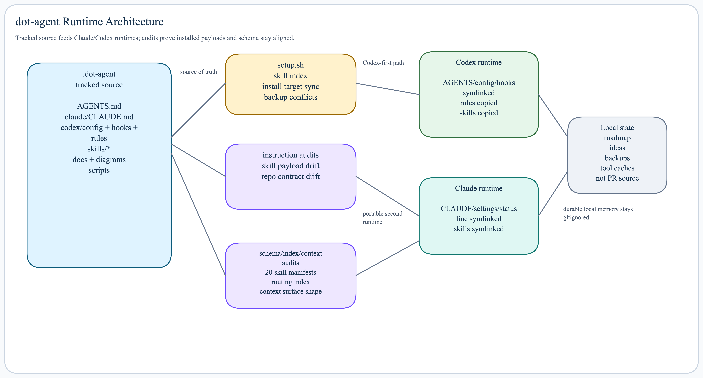

# dot-agent

Ash's personal agent harness for Claude Code and Codex.



`~/.dot-agent/` is the versioned source of truth. Runtime homes are install
targets. Machine-local state stays under the gitignored `state/` tree.

## Architecture

```text
~/.dot-agent/
├── AGENTS.md        # repo/group-level harness instructions
├── claude/          # Claude runtime config source and pointer file
├── codex/           # Codex config/rules source
├── skills/          # shared skill source of truth
├── scripts/         # setup audit and helper scripts
├── state/           # gitignored local state and tool caches
├── docs/            # tracked harness docs and diagrams
├── setup.sh
└── README.md
```

Installed runtime shape:

```text
~/.claude/
├── CLAUDE.md
├── settings.json
├── statusline-enhanced.sh
└── skills/

~/.codex/
├── AGENTS.md
├── config.toml
├── hooks.json
├── rules/
└── skills/
```

## Setup

Clone at the canonical path and run setup:

```bash
git clone https://github.com/aashrayap/dot-agent.git ~/.dot-agent
~/.dot-agent/setup.sh
```

After pulling or changing skills/config:

```bash
git -C ~/.dot-agent pull --ff-only
~/.dot-agent/setup.sh
```

To run only instruction drift checks without reinstalling runtime files:

```bash
~/.dot-agent/setup.sh --check-instructions
```

`setup.sh`:

- symlinks Claude config into `~/.claude/`
- symlinks root `AGENTS.md` into `~/.codex/AGENTS.md`
- symlinks Codex config and hooks into `~/.codex/`
- syncs Codex rules into `~/.codex/rules/`
- installs skills into both runtimes based on `skill.toml`
- creates `state/{collab,ideas}`
- backs up conflicting legacy runtime files under `state/backups/setup/`
- runs read-only skill and repo instruction audits
- reports drift, but does not patch project-local instruction files
- supports `--check-instructions` for audit-only verification

Additional read-only checks:

```bash
python3 ~/.dot-agent/scripts/validate-skill-manifests.py
python3 ~/.dot-agent/skills/context-surface-audit/scripts/context-surface-audit.py --format text
```

The manifest validator checks local `skill.toml` schema and selected entries.
The context audit reports word counts, duplicate anchors, runtime install
shape, and schema coverage without reading transcript content.

## Versioned Vs Local

Track portable runtime defaults here. Keep these out of tracked config:

- private context
- machine-local trusted project paths
- risky permission bypass flags
- one-off local commands or allow rules
- generated state and tool caches

Use `state/` for local operating memory:

- `state/collab/roadmap.md`
- `state/ideas/<slug>/`
- `state/tools/`

## Human Daily Loop

The normal day-start surface is the human roadmap, not project/session memory.

- `state/collab/roadmap.md` is the day board: focus, active projects, review
  queue, and parked or blocked work.
- `morning-sync` reads roadmap rows by default and returns plain-language
  project/task bullets.
- `focus` mutates the roadmap and keeps the board human-scannable.
- `daily-review` owns day-end closure, recap, and completed-row drainage.
- `spec-new-feature` owns deep code-grounded planning and implementation
  artifacts.
- `execution-review` stays forensic: session quality, verification, skill use,
  and failure analysis.

Session IDs, dependency graphs, and runtime transcript anchors belong in
forensic execution artifacts, not in the daily board.

## Human Review Surfaces

Review the contract layer first:

1. `README.md` and `AGENTS.md` for repo/runtime intent
2. `skills/README.md`, `skills/AGENTS.md`, `SKILL.md`, and `skill.toml` for
   skill behavior
3. code sampling when setup, runtime, state mutation, renderers, adapters, or
   generated outputs change
4. existing diagrams only when they materially clarify workflow or architecture

Human-presenting skills may reuse or create a diagram when workflow,
architecture, planning, review, or decision state is hard to follow in prose.
Do not treat a fresh diagram as the default cost of every non-trivial change.

`handoff-research-pro` is the external critique gate for expensive-to-unwind
decisions. It packages repo context, review target, source policy, assumptions
to falsify, blind spots, validation, and findings intake into
`docs/handoffs/<slug>-research-pro-review.md`; it does not replace local
implementation, tests, or repo-grounded review.

## Skills

Skills live under `skills/` and install through `setup.sh`. Use
`skills/AGENTS.md` for the strict agent-facing authoring contract, and
`skills/README.md` for the human-facing skill architecture, setup, and
composability guide.

`SKILL.md` stays runtime-readable. Local `skill.toml` carries schema v1 for
composition, contract, path, and invocation validation; see
`skills/references/skill-manifest-schema.md`.
