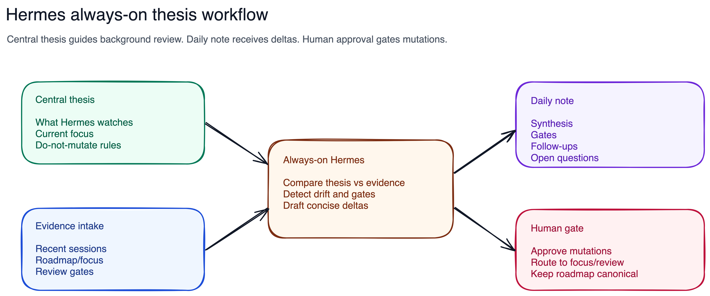

# Hermes Always-On Thesis

## Purpose

Define one durable operating surface for Hermes: a centralized thesis, a daily working document model, and default background behavior that can watch work without stealing the wheel from the human roadmap.

## Current Phase

- `01_spec.md`: approved
- `02_questions.md`: approved
- `03_research.md`: complete
- `04_design.md`: approved
- `05_tasks.md`: complete

## Visual

## Working Thesis To Validate

Hermes should be an always-available background reviewer that compares recent execution evidence against a centralized thesis for the day, then writes concise, actionable deltas into a daily operating note. It should surface contradictions, gates, and follow-ups, but should not mutate roadmap state or expose raw runtime internals without explicit approval.

## Human Checkpoint

End-to-end first slice is implemented. Hermes findings reach human review through the daily synthesis immediately, through the hourly `Hermes Watch` heartbeat inbox in the background, through morning-sync as a tiny status line, and through execution-review for full detail.
