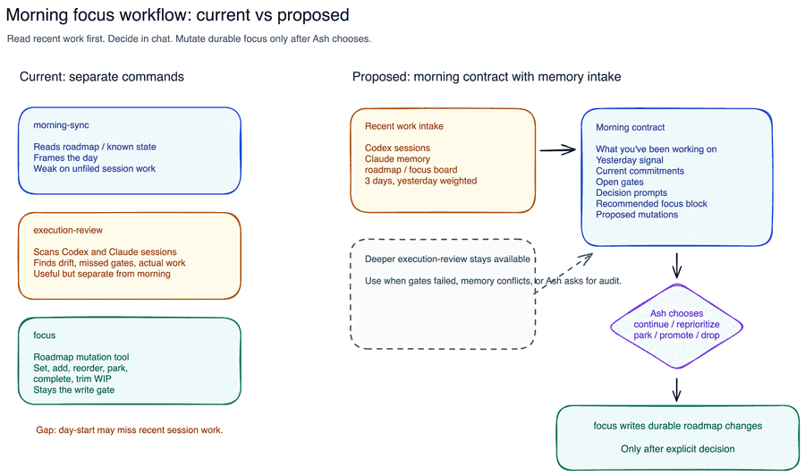

# Morning Focus Review Contract

## Purpose

Shape a merged day-start workflow where `morning-sync` reads recent Codex and Claude work, highlights what Ash has actually been working on, and then asks whether to continue, reprioritize, park, promote, or drop work.

## Current Decision

- Prefer `morning-sync` when the question is "what should I do today?"
- Prefer `focus` when Ash already knows the change and wants to mutate the roadmap.
- Prefer `execution-review` when the question is forensic: what happened, what drifted, what gate failed, or what should be audited.
- Proposed merge: `morning-sync` can run a lightweight execution-review intake before producing the morning contract, but `focus` remains the only roadmap write gate.
- Research update: current contracts support `morning-sync` auto-suggesting concrete `focus` changes after synthesis, but not silently running roadmap mutations.
- Hermes update: the consumer bridge exists under `execution-review`, but no Hermes findings have been generated into the shared JSONL file.
- Decision update: morning sync should always scan recent Codex/Claude work, using yesterday as primary, 2 prior days as secondary, and 5 prior days as tertiary context.
- Decision update: inferred projects not on the roadmap appear under `User Decides`; roadmap remains central and nothing is auto-added.
- Decision update: multi-project mornings should not offer a single bulk apply. Ash chooses stream(s), then `focus` handles selected roadmap mutations.
- Decision update: working docs are approval-only and should prefer one concise packet linking important supporting docs.
- Implementation update: `morning-sync` now has a read-only recent-work helper, `focus` has an approval-only morning working-doc helper, and changed skills were installed through `setup.sh`.

## Proposed Contract

- `Date`
- `Window`
- `What you've been working on`
- `User Decides`
- `Current commitments`
- `Open gates`
- `Recent PRs`
- `Hermes`
- `Recommended focus`
- `Decision prompt`
- `Roadmap mutations proposed`
- `Not changing unless approved`

## Visual

## Checkpoint

Implemented end to end. Next step is to use `morning-sync` normally and decide which `User Decides` stream, if any, should be promoted into the roadmap.
