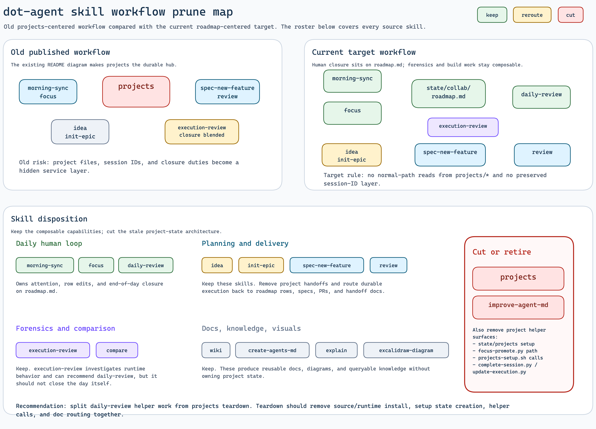
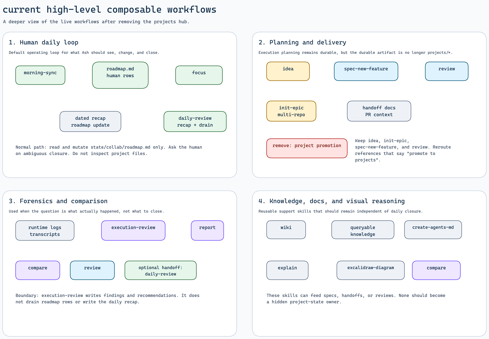
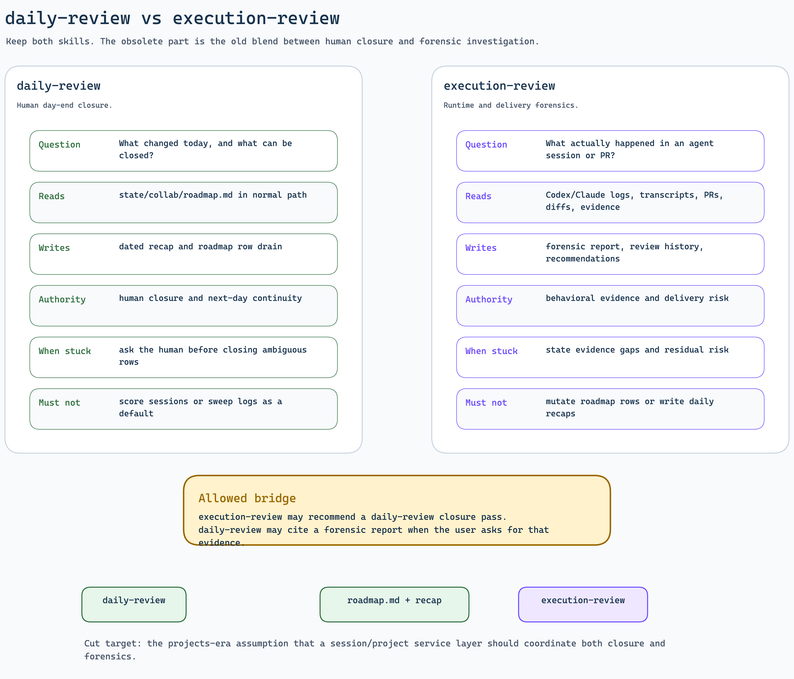

# Skill Workflow Prune Comparison

Last compared: 2026-04-18

## Inputs

- Old published workflow: `docs/diagrams/skill-composability-workflow.excalidraw`
- Current target handoff: `docs/handoffs/human-daily-loop-redesign.md`
- Current skill contracts: `skills/*/SKILL.md` and `skills/*/skill.toml`
- Rendered diagrams:
  - `docs/diagrams/skill-workflow-prune-map.png`
  - `docs/diagrams/skill-workflow-drilldowns.png`
  - `docs/diagrams/daily-vs-execution-review.png`

## Diagram Outputs

Editable sources:

- `docs/diagrams/skill-workflow-prune-map.excalidraw`
- `docs/diagrams/skill-workflow-drilldowns.excalidraw`
- `docs/diagrams/daily-vs-execution-review.excalidraw`
- `docs/artifacts/skill-workflow-prune/generate-diagrams.mjs`

## Delta Summary

The old workflow made `projects` the durable hub between daily attention, promoted ideas, feature specs, PR delivery, and closure. That was useful while the harness needed a project/session state layer, but it now conflicts with the human daily loop redesign.

The current target makes `state/collab/roadmap.md` the normal-path state surface for human closure. Build planning still lives in specs, handoffs, PRs, and repo artifacts. Forensics still lives in `execution-review` reports and evidence logs. There should be no hidden session-ID service layer preserved under `projects`.

## Higher-Level Workflows

| Workflow | Keep skills | State/output owner |
| --- | --- | --- |
| Human daily loop | `morning-sync`, `focus`, `daily-review` | `state/collab/roadmap.md`, dated recap, row drain |
| Planning and delivery | `idea`, `init-epic`, `spec-new-feature`, `review` | idea notes, feature artifacts, handoffs, PRs |
| Forensics and comparison | `execution-review`, `compare`, `review` | execution reports, comparison notes, PR review findings |
| Knowledge/docs/visual reasoning | `wiki`, `create-agents-md`, `explain`, `excalidraw-diagram` | compiled wiki, agent docs, explanation artifacts, diagrams |

## Cut List

| Surface | Disposition | Reason |
| --- | --- | --- |
| `projects` skill | Cut | It is the obsolete project/session architecture. The handoff now says full removal, not archive-or-freeze. |
| `skills/projects/scripts/*` | Cut with the skill | `projects-setup.sh`, `complete-session.py`, and `update-execution.py` preserve the old state layer. |
| `setup.sh` creation of `state/projects` | Remove | Setup should not recreate the removed architecture. |
| `skills/focus/scripts/focus-promote.py` | Remove or rewrite | It currently promotes roadmap work into the projects helper path. |
| `improve-agent-md` | Retire after compatibility window | It is a legacy alias for `create-agents-md`, not a distinct workflow. |

## Reroute List

| Surface | Reroute needed |
| --- | --- |
| `idea` | Replace "promote to projects" guidance with spec, roadmap, or handoff routing. |
| `init-epic` | Stop telling the user to enter the `projects` skill after setup. |
| `spec-new-feature` | Remove project tracking assumptions; keep artifact-driven feature planning. |
| `focus` | Keep roadmap row mutation; remove project promotion as normal workflow. |
| `execution-review` | Keep forensic reporting; remove optional project context as a hidden coordination path. |
| Root and skills docs | Replace old projects-centered diagrams and routing text with the new map. |

## daily-review vs execution-review

Keep both skills. The obsolete behavior is the old blend between closure and forensics.

`daily-review` owns human closure. It reads the roadmap in the normal path, writes the dated recap, drains completed roadmap rows through deterministic helpers, and asks the human before ambiguous closure.

`execution-review` owns forensic review. It reads runtime logs, transcripts, PR context, diffs, and evidence; writes reports/history/recommendations; and can recommend a `daily-review` pass. It should not mutate roadmap rows or write the daily recap.

## PR Slicing

Initial recommendation:

1. Daily-review helper PR: implement the deterministic daily-review drain helper. This is independent and can land before or after teardown.
2. Projects teardown PR: remove the `projects` source skill, runtime install path, setup state creation, helper calls, and docs routing together. Splitting the teardown across code and docs would leave misleading live instructions.
3. Local state decision before teardown lands: inspect or archive gitignored `state/projects/*` if any historical notes are worth keeping. Do not preserve session IDs as a hidden service layer.

Execution note: the follow-up implementation intentionally combined the helper
and teardown after the user asked to execute the plan end to end. The local
gitignored `state/projects/*` directory remains outside tracked source.
