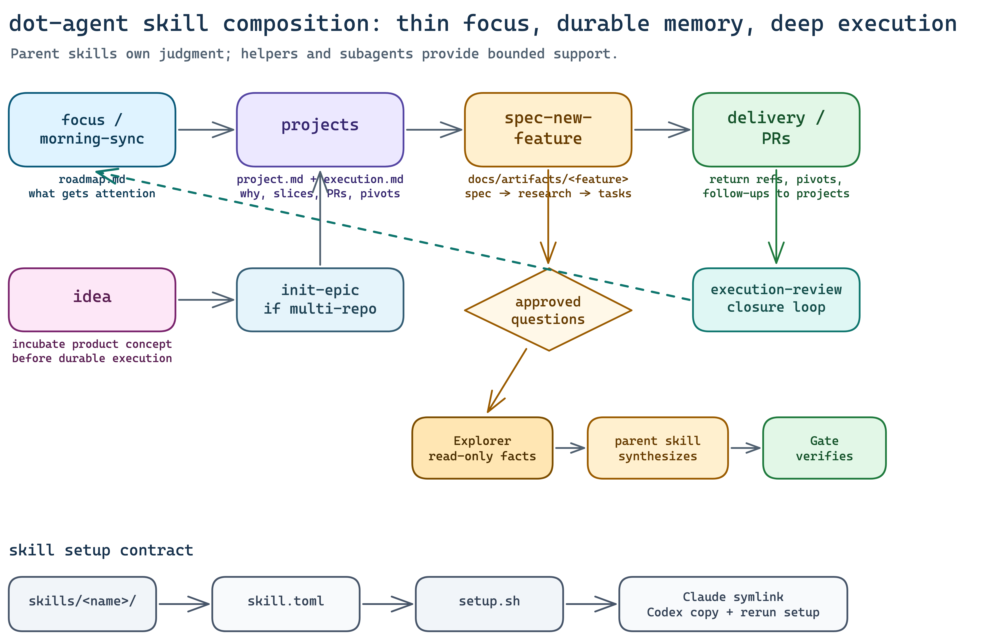

# Skills

`skills/` is the source of truth for shared Claude and Codex skills.



## Authoring Contract

Every retained skill must have:

- `SKILL.md`
- `skill.toml`
- a strict `## Composes With` section in `SKILL.md`

Minimum shape:

```text
skills/<name>/
├── SKILL.md
└── skill.toml
```

Expanded shape:

```text
skills/<name>/
├── SKILL.md
├── claude/SKILL.md      # optional thin runtime wrapper
├── codex/SKILL.md       # optional thin runtime wrapper
├── scripts/             # deterministic helpers
├── references/          # schemas, patterns, setup notes
├── assets/              # templates and static output assets
├── shared/              # runtime-neutral support
└── skill.toml
```

`## Composes With` schema:

```markdown
## Composes With

- Parent:
- Children:
- Uses format from:
- Reads state from:
- Writes through:
- Hands off to:
- Receives back from:
```

Fill unused rows with `none`. Keep entries concrete: name the owning skill,
state file, helper script, artifact path, or runtime surface.

## Runtime Setup

`setup.sh` reads `skill.toml`.

Portable shared skill:

```toml
name = "wiki"
targets = ["claude", "codex"]
default_entry = "SKILL.md"
```

Shared skill with runtime wrappers:

```toml
name = "spec-new-feature"
targets = ["claude", "codex"]
default_entry = "SKILL.md"
claude_entry = "claude/SKILL.md"
codex_entry = "codex/SKILL.md"
```

Codex-only skill:

```toml
name = "morning-sync"
targets = ["codex"]
default_entry = "SKILL.md"
```

Runtime install behavior:

| Runtime | Behavior | Implication |
|---------|----------|-------------|
| Claude | Symlinks selected entrypoint and shared dirs | Repo edits are visible immediately |
| Codex | Copies selected payload and shared dirs | Rerun `setup.sh` after skill edits |

Shared dirs installed with a skill:

- `scripts/`
- `assets/`
- `references/`
- `shared/`

## Composability Model

Skills should compose instead of duplicating ownership.

| Pattern | Meaning | Example |
|---------|---------|---------|
| Parent | Skill owns the current user request | `morning-sync` owns day-start summary |
| Child | Skill may be invoked as a narrower surface | `focus` mutates roadmap rows |
| Uses format | Borrow presentation without handing off ownership | `compare` uses `explain` visual modes |
| Reads state | Observe another surface without writing it | `morning-sync` reads projects |
| Writes through | Mutate only through the owning helper | `execution-review` drains through `focus` / `projects` |
| Hands off | Transfer ownership to a better surface | `projects` hands code-grounded work to `spec-new-feature` |
| Receives back | Accept delivery reality from another workflow | `projects` receives PRs and pivots |

Default ownership:

- `roadmap.md`: `focus`
- `state/projects/<slug>/`: `projects`
- `state/ideas/<slug>/`: `idea`
- `docs/artifacts/<feature>/`: `spec-new-feature`
- session closure reports: `execution-review`

## Research And Subagents

Research-heavy skills keep one parent skill as orchestrator. Use subagents only
when the user explicitly authorizes delegation or parallel work.

- Explorer: read-only factual investigation.
- Worker / Implementor: bounded file-scoped edits.
- Gate / Verifier: independent validation of changed files and commands.

For decontaminated research, Explorer sees approved questions or source paths,
not the desired answer. The parent skill reconciles conflicts and writes the
artifact through the owning surface.

## Dependency-Bearing Skills

If a skill has executable support:

1. Keep the model-facing workflow in `SKILL.md`.
2. Put helper code in `scripts/`.
3. Put setup notes, schemas, and external references in `references/`.
4. Put templates/static output assets in `assets/`.
5. Keep caches, virtual environments, browser installs, and generated state out
   of tracked source.
6. Run `~/.dot-agent/setup.sh` and verify both runtime installs.

## Excalidraw Diagram Skill

`excalidraw-diagram` is the diagramming surface for durable visual artifacts.

Use it when a workflow, architecture, or research artifact should have an
editable Excalidraw source and a rendered PNG.

Artifact contract:

```text
docs/diagrams/<slug>.excalidraw   # editable source of truth
docs/diagrams/<slug>.png          # rendered image for docs/review
```

Render with:

```bash
~/.dot-agent/skills/excalidraw-diagram/scripts/render-excalidraw.sh \
  docs/diagrams/<slug>.excalidraw \
  docs/diagrams/<slug>.png
```

The renderer is cached under `~/.dot-agent/state/tools/`, not vendored into
tracked skill source. The skill workflow is:

```text
describe concept -> create .excalidraw -> render PNG -> inspect -> fix -> rerender
```
