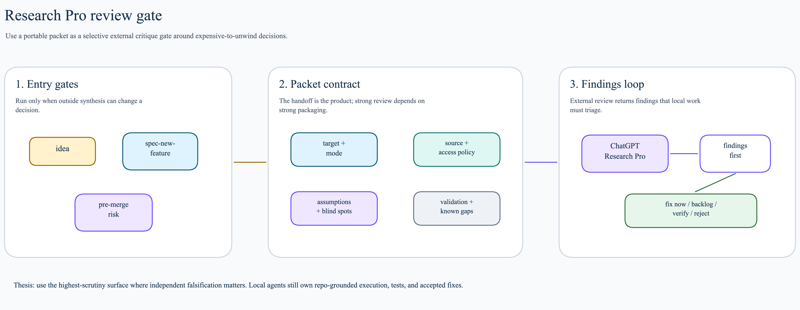

# Skills

`skills/` is the source of truth for shared Claude and Codex skills.


## Authoring Contract

Every retained skill must have:

- `SKILL.md`
- `skill.toml`
- a strict `## Composes With` section in `SKILL.md`

Minimum shape:

```text
skills/<name>/
├── SKILL.md
└── skill.toml
```

Expanded shape:

```text
skills/<name>/
├── SKILL.md
├── claude/SKILL.md      # optional thin runtime wrapper
├── codex/SKILL.md       # optional thin runtime wrapper
├── scripts/             # deterministic helpers
├── references/          # schemas, patterns, setup notes
├── assets/              # templates and static output assets
├── shared/              # runtime-neutral support
└── skill.toml
```

`## Composes With` schema:

```markdown
## Composes With

- Parent:
- Children:
- Uses format from:
- Reads state from:
- Writes through:
- Hands off to:
- Receives back from:
```

Fill unused rows with `none`. Keep entries concrete: name the owning skill,
state file, helper script, artifact path, or runtime surface.

## Runtime Setup

`setup.sh` reads `skill.toml`.

Portable shared skill:

```toml
name = "wiki"
targets = ["claude", "codex"]
default_entry = "SKILL.md"
```

Shared skill with runtime wrappers:

```toml
name = "spec-new-feature"
targets = ["claude", "codex"]
default_entry = "SKILL.md"
claude_entry = "claude/SKILL.md"
codex_entry = "codex/SKILL.md"
```

Dual-runtime instruction-authoring skill:

```toml
name = "improve-agents-md"
targets = ["claude", "codex"]
default_entry = "SKILL.md"
claude_entry = "claude/SKILL.md"
codex_entry = "codex/SKILL.md"
```

`improve-agents-md` owns improvement, creation, and translation of both Codex
`AGENTS.md` and Claude `CLAUDE.md` surfaces. Bias toward tightening existing
files in place; fall back to creation when no useful instruction file exists.
Use it to establish the Human Response Contract explicitly when a repo lacks it.
Keep shared instruction-generation logic at the skill root; use runtime
wrappers only for Claude/Codex formatting bias.

Codex-only skill:

```toml
name = "morning-sync"
targets = ["codex"]
default_entry = "SKILL.md"
```

Runtime install behavior:

| Runtime | Behavior | Implication |
|---------|----------|-------------|
| Claude | Symlinks selected entrypoint and shared dirs | Repo edits are visible immediately |
| Codex | Copies selected payload and shared dirs | Rerun `setup.sh` after skill edits |

Shared dirs installed with a skill:

- `scripts/`
- `assets/`
- `references/`
- `shared/`

## Composability Model

Skills should compose instead of duplicating ownership.

| Pattern | Meaning | Example |
|---------|---------|---------|
| Parent | Skill owns the current user request | `morning-sync` owns day-start summary |
| Child | Skill may be invoked as a narrower surface | `focus` mutates roadmap rows |
| Uses format | Borrow presentation without handing off ownership | `compare` uses `explain` visual modes |
| Reads state | Observe another surface without writing it | `morning-sync` reads roadmap rows |
| Writes through | Mutate only through the owning helper | `daily-review` drains completed rows through `focus` |
| Hands off | Transfer ownership to a better surface | `idea` hands code-grounded work to `spec-new-feature` |
| Receives back | Accept delivery reality from another workflow | `daily-review` receives completed-row state from `focus` |

Default ownership:

- `roadmap.md`: `focus`
- `state/ideas/<slug>/`: `idea`
- `docs/artifacts/<feature>/`: `spec-new-feature`
- `docs/UBIQUITOUS_LANGUAGE.md`: `ubiquitous-language`
- `state/collab/daily-reviews/`: `daily-review`
- forensic session reports: `execution-review`
- `AGENTS.md`/`CLAUDE.md` improvement, creation, or translation: `improve-agents-md`
- external remote-review packets: `handoff-research-pro`

## Workflow Groups

High-level user workflows should route through a small owner surface, then
compose narrower skills instead of duplicating their rules.

| Group | Entry Skill | Composes |
|-------|-------------|----------|
| Daily loop | `morning-sync` | `focus`, `daily-review`, `idea`, `spec-new-feature` |
| Idea to PR | `idea` or `spec-new-feature` | `init-epic`, `handoff-research-pro`, `review`, `focus` |
| Shared language | `ubiquitous-language` | `spec-new-feature`, `review`, `improve-agents-md` |
| Visual reasoning | `visual-reasoning` | `explain`, `compare`, `excalidraw-diagram` |

Use `visual-reasoning` when the user wants a grouped visual thinking workflow:
explain something, compare it against another shape, and optionally preserve
the result as a rendered Excalidraw artifact. Use direct child skills when the
request clearly needs only one move.

## External Review Gate



`handoff-research-pro` packages a selective external critique gate. Use it when
the next decision would be expensive to unwind:

- after `idea` if product, strategy, or external assumptions need falsification
- during `spec-new-feature` before design or task artifacts become execution
  direction
- before merge for instruction-heavy, architecture-heavy, migration-heavy, or
  easy-to-rationalize changes

The gate is packet-first. The packet should pin the target and review mode,
state source/access policy, name assumptions to falsify and reviewer blind
spots, and define how returned findings feed back into fixes, PR notes,
roadmap rows, feature tasks, or handoff docs. Do not justify the gate by model
price alone; use it where independent synthesis can change a decision.

## Human Presentation

Human-presenting skills should be visual-first when they explain workflow,
architecture, planning, review, decisions, or proposed state.

Default ladder:

1. Link an existing Excalidraw diagram or create a new one for the shape of the
   work.
2. Give a short prose summary that names the decision or proposed state.
3. Use text, tables, file references, acceptance criteria, or code review for
   drill-down.

This applies most often to `morning-sync`, `focus`, `daily-review`,
`execution-review`, `spec-new-feature`, `idea`, `visual-reasoning`, `compare`,
`explain`, and `improve-agents-md`. `handoff-research-pro` links an existing
visual only when it materially helps the remote reviewer understand the change.

Do not force a new diagram for one-line status updates, direct command output,
small mechanical edits, narrow line-specific review findings, or transient
progress messages. Reuse an existing diagram when it already explains the
current shape.

Keep this rule in human-facing docs and the relevant `SKILL.md` files. Do not
put Excalidraw-specific policy in `skills/AGENTS.md`.

## Human Response Contract

The response packet should stay short and readable: `This Session Focus`,
`Result`, and one or more concrete `Next Actions`.

`This Session Focus` is the first slot. Keep it to 1-2 short lines that remind
Ash why the session started and where the work stands.

`Result` carries the useful receipt: what changed, what was verified, what
remains open, and any useful visual or detail links. For workflow,
architecture, planning, review, decision, or multi-artifact work, include or
link the relevant visual inside `Result`.

Use `Ledger` only when state could otherwise disappear: multiple user requests,
corrections, follow-ups, parked items, or handoff-heavy work. Track `Captured`,
`Done`, `Not Done`, and `Parked` when using it.

`Next Actions` should include concrete next steps and, when useful, concise
user-direction questions that can be answered by number or short phrase.

Durable summary artifacts are conditional: create them only when the skill owns
a persistent record or the work benefits from one. Before final response, map
the latest user requests to the packet. Every request should be done, parked, or
called out as not done.

Examples:

- `spec-new-feature`: response packet plus linked spec or artifact set under
  `docs/artifacts/<feature>/`.
- `execution-review`: response packet plus a forensic report when the review
  needs a retained record.
- `daily-review`: response packet plus the drained daily review record in
  `state/collab/daily-reviews/`.
- `visual-reasoning`: response packet plus linked rendered visual only when the
  work created or updated a durable diagram.
- Small or no-artifact work: response packet only.

## Research And Subagents

Research-heavy skills keep one parent skill as orchestrator. Use subagents only
when the user explicitly authorizes delegation or parallel work.

- Explorer: read-only factual investigation.
- Worker / Implementor: bounded file-scoped edits.
- Gate / Verifier: independent validation of changed files and commands.

For decontaminated research, Explorer sees approved questions or source paths,
not the desired answer. The parent skill reconciles conflicts and writes the
artifact through the owning surface.

## Dependency-Bearing Skills

If a skill has executable support:

1. Keep the model-facing workflow in `SKILL.md`.
2. Put helper code in `scripts/`.
3. Put setup notes, schemas, and external references in `references/`.
4. Put templates/static output assets in `assets/`.
5. Keep caches, virtual environments, browser installs, and generated state out
   of tracked source.
6. Run `~/.dot-agent/setup.sh` and verify both runtime installs.

## Excalidraw Diagram Skill

`excalidraw-diagram` is the diagramming surface for durable visual artifacts.

Use it when a workflow, architecture, or research artifact should have an
editable Excalidraw source and a rendered PNG.

Artifact contract:

```text
docs/diagrams/<slug>.excalidraw   # editable source of truth
docs/diagrams/<slug>.png          # rendered image for docs/review
```

Render with:

```bash
~/.dot-agent/skills/excalidraw-diagram/scripts/render-excalidraw.sh \
  docs/diagrams/<slug>.excalidraw \
  docs/diagrams/<slug>.png
```

The renderer is cached under `~/.dot-agent/state/tools/`, not vendored into
tracked skill source. The skill workflow is:

```text
describe concept -> create .excalidraw -> render PNG -> inspect -> fix -> rerender
```
