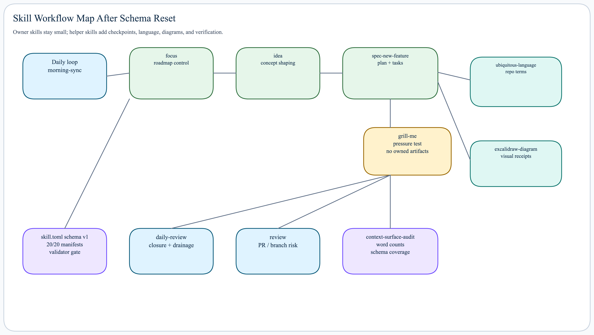

# Skills

`skills/` is source for shared Claude and Codex skills.



## Skill Shape

Every retained skill has:

```text
skills/<name>/
├── SKILL.md
└── skill.toml
```

Optional directories:

```text
scripts/     deterministic helpers
references/  schemas, setup notes, lookup docs
assets/      templates and static output assets
shared/      runtime-neutral support
claude/      thin Claude wrapper when needed
codex/       thin Codex wrapper when needed
```

`SKILL.md` stays runtime-readable. It owns trigger nuance, core workflow,
judgment boundaries, and `## Composes With`.

`skill.toml` owns local machine-checkable structure: targets, entrypoints,
schema version, composition graph, contracts, declared paths, and invocation
flags. Schema v1 is documented in
[skill-manifest-schema.md](references/skill-manifest-schema.md).

## Runtime Setup

`setup.sh` reads `skill.toml`.

```toml
name = "wiki"
targets = ["claude", "codex"]
default_entry = "SKILL.md"
schema_version = 1
```

Runtime-specific wrappers stay thin:

```toml
name = "spec-new-feature"
targets = ["claude", "codex"]
default_entry = "SKILL.md"
claude_entry = "claude/SKILL.md"
codex_entry = "codex/SKILL.md"
schema_version = 1
```

Install behavior:

| Runtime | Behavior | Implication |
| --- | --- | --- |
| Claude | Symlinks selected entrypoint and shared dirs | Source edits are visible immediately |
| Codex | Copies selected skill payloads | Rerun `setup.sh` after skill edits |

## Composability Model

`## Composes With` keeps runtime-visible awareness. `skill.toml` makes the same
shape auditable.

| Row | Meaning |
| --- | --- |
| Parent | Skill or context that owns the current request |
| Children | Narrower skill/helper this skill may invoke |
| Uses format from | Presentation borrowed without ownership transfer |
| Reads state from | State/docs/runtime evidence observed |
| Writes through | Owner/helper used for mutation |
| Hands off to | Surface that can take over ownership |
| Receives back from | Surface that returns delivery reality |

Default ownership lives in
[roadmap-and-handoff-surfaces.md](references/roadmap-and-handoff-surfaces.md).

## Workflow Groups

| Group | Entry Skill | Composes |
| --- | --- | --- |
| Daily loop | `morning-sync` | `focus`, `daily-review`, `idea`, `spec-new-feature` |
| Idea to PR | `idea` or `spec-new-feature` | `init-epic`, `handoff-research-pro`, `review`, `focus` |
| Visual reasoning | `visual-reasoning` | `explain`, `compare`, `excalidraw-diagram` |
| Context/review | `context-surface-audit` or `execution-review` | structural counts vs forensic evidence |

Use the smallest owner surface that matches the user's ask, then compose child
skills instead of duplicating their workflows.

## Shared References

- [skill-authoring-contract.md](references/skill-authoring-contract.md):
  source-only policy, minimum shape, setup contract.
- [skill-manifest-schema.md](references/skill-manifest-schema.md): local
  schema v1 and validation rules.
- [output-packet.md](references/output-packet.md): Ash-facing final packet.
- [subagent-delegation.md](references/subagent-delegation.md): role contracts
  when delegation is explicitly authorized.
- [roadmap-and-handoff-surfaces.md](references/roadmap-and-handoff-surfaces.md):
  state ownership and handoff paths.

## Verification

```bash
python3 scripts/validate-skill-manifests.py
python3 skills/context-surface-audit/scripts/context-surface-audit.py --format text
./setup.sh --check-instructions
```

Use the first command for manifest/schema drift, the second for context-surface
shape, and setup audit for installed runtime payload drift.
