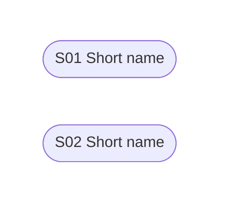

# Projects Skill

## Composes With

- Parent: `roadmap.md` rows that outgrow the daily board.
- Children: `spec-new-feature` for code-grounded implementation slices; `excalidraw-diagram` when durable project state needs a visual map.
- Uses format from: `excalidraw-diagram` for human-facing workstream, dependency, or before/after maps when useful.
- Reads state from: `~/.dot-agent/state/projects/<slug>/project.md`, optional `execution.md`, optional `AUDIT_LOG.md`, and related roadmap rows.
- Writes through: `projects-setup.sh`, `complete-session.py`, and `update-execution.py` when execution memory exists.
- Hands off to: `spec-new-feature` when Current Slice needs deep planning or code grounding.
- Receives back from: `spec-new-feature` with PRs, pivots, and follow-ups; `execution-review` with forensic recommendations.

## Context

Run `~/.dot-agent/skills/projects/scripts/projects-setup.sh "$1"` first.

Deterministic helpers:

- `~/.dot-agent/skills/projects/scripts/update-execution.py`
- `~/.dot-agent/skills/projects/scripts/complete-session.py`

Read the project file. Read `execution.md` and `AUDIT_LOG.md` only when they exist or when the user is asking for execution-state changes.

## Workflow Position

- `init-epic` bootstraps a new coordination workspace and repo map.
- `projects` owns durable milestones, live execution slices, and execution memory once that workspace exists.
- `focus` owns the human daily board and may link to projects when durable memory is needed.
- `morning-sync` reads roadmap rows by default; it should inspect project internals only on explicit user drill-down or migration.

## Structure

**project.md** — thin durable bridge: why the workstream exists, current slice, useful links, done refs, follow-ups, and handoff notes.

**execution.md** — optional durable execution memory: progress summary, PR ledger, pivots, effort and precision summary, and open follow-ups. Create it only when the project crosses the complexity threshold.

**AUDIT_LOG.md** — optional historical record of what changed and why for complex or long-running workstreams.

Projects live under `~/.dot-agent/state/projects/` so both Claude and Codex on the same machine share the same state.

`project.md` remains the durable bridge from roadmap to implementation. `execution.md`
records delivery reality only when needed. Technical details and codebase
exploration are `/spec-new-feature`'s job. Prefer one current slice over
speculative micro-steps.

When presenting a complex workstream to a human, prefer a high-level diagram of
current slice, durable memory, PR/follow-up flow, or dependency shape before
deep tables. Reuse an existing diagram when it still matches reality.

## Key Concepts

**Current Slice** — The one next thing worth picking up. If there is no clear current slice, the project should probably stay in roadmap/focus.

**Milestones** — Optional leadership-facing progress markers. Add them only when the workstream is complex enough to need durable sequencing.

**Sessions** — Optional delivery slices tackled via `/spec-new-feature` or direct execution. Add formal session blocks only when the current slice is no longer enough.

**Execution Memory** — The running ledger for what moved during delivery: current status, PRs, pivots, effort, and follow-ups.

**PR Ledger** — Every delivery artifact that matters, including merged PRs, open PRs, discarded PRs, external/manual PRs, and important non-PR refs.

**Pivots & Changes** — The dated explanation for why execution diverged from the original plan: discarded approaches, reordered phases, scope cuts, new tasks, dependency changes, or post-completion fixes.

**Effort & Precision** — Retrospective metrics that compare estimated effort to actual active effort and describe how cleanly the plan survived execution.

## Routing

| MODE | Action |
|------|--------|
| `dashboard` | Show all projects listed by the script |
| `existing` | Read project state and execution memory. Use any additional user description to determine intent |
| `new` | Gather goal, scope, milestones, sessions, and dependencies. Write the planning docs and seed execution memory |

## Rules

- Use YYYY-MM-DD dates. Update `last_touched` on every doc change.
- Every material change to complex project state gets a dated `AUDIT_LOG.md` entry. Thin project edits can stay in `project.md` until execution memory is ensured.
- Material changes to `execution.md` should also be reflected in `AUDIT_LOG.md` when they alter the project story: new PRs, pivots, scope changes, or major follow-ups. Routine metric refreshes do not need a standalone entry.
- Keep `project.md` and `execution.md` distinct: planning belongs in `project.md`; execution reality belongs in `execution.md`.
- Prefer one clear item in `## Current Slice`.
- Keep live slices short. Usually one current slice plus a few follow-ups is enough.
- Dependency graphs are optional. Use them only when there are 3+ live slices, real parallel work, or non-obvious sequencing risk.
- Do not create sessions just to read, inspect, brainstorm, or prepare. Put that detail in execution artifacts or the working session instead.
- If a stale speculative graph no longer matches delivery reality, collapse it into history instead of keeping two competing live plans.
- If the user is still choosing priorities, redirect to `focus`. If they first need a new coordination repo, redirect to `init-epic`.
- Use plain PR IDs or refs in the first column of the `PRs` table.
- Hyperlink external references when you cite them in narrative text. No bare URLs.
- Preserve the user's language.
- Track external work as first-class delivery history. If a PR was created manually or by another session, add it when discovered instead of treating it as out-of-band.
- Track discarded PRs and abandoned approaches with the same rigor as merged work. The failure mode and replacement path matter.
- Do not let `execution.md` become a transcript. Rewrite `Progress Summary` as the current story.

### Execution Memory

Use `execution.md` to keep a project legible across long-running work:

- `## Progress Summary` should explain the current state in a few sentences, not a transcript.
- `## PRs` tracks real delivery artifacts and their state, including discarded and external PRs.
- `## Pivots & Changes` records scope or direction changes with a date and reason.
- `## Effort Summary` tracks simple metrics when they are informative; include compression and precision when enough PR data exists.
- `## Open Follow-ups` captures concrete loose ends that survived the latest session.

When reading an existing project, read `execution.md` whenever it exists. If it does not exist and the user is asking for execution-state updates, rerun setup as `projects-setup.sh --ensure-execution "$1"` before writing.

### Complexity Threshold

Keep work in `roadmap.md` when it is same-day, simple, or does not need durable memory.

Create a thin project when a roadmap row:

- spans multiple days
- needs a durable current slice
- has important links or refs
- may hand off to `spec-new-feature`

Ensure `execution.md` only when the workstream has PRs, pivots, discarded attempts,
multiple sessions, or follow-ups that need an execution ledger.

### Execution Sync

Use this when the user asks to sync project state, resume execution, account for external progress, or reconcile what shipped.

1. Read `project.md`, plus `execution.md` and `AUDIT_LOG.md` when present.
2. Check known refs and recent relevant PRs when GitHub context is available:
   - open PRs
   - merged PRs
   - closed-unmerged PRs that may be discarded work
   - branches or commits referenced by the current available session
3. Cross-reference PR titles, branches, linked issues, and changed files against available/completed sessions and `05_tasks.md` when a spec artifact exists.
4. Update execution memory:
   - add missing PR/ref rows
   - mark discarded work clearly with the replacement or rationale
   - refresh `Progress Summary`
   - add a pivot when execution diverged from the plan
   - add concrete follow-ups for unresolved loose ends
5. Update `project.md` only when the durable planning state changed: sessions completed, sessions unblocked, blockers resolved, or the live slice set is stale.
6. Add an `AUDIT_LOG.md` entry for material story changes when audit logging is enabled or after ensuring execution memory.

Sync should be lightweight but evidence-based. Do not ask unnecessary questions when the external signals are clear; do ask when a closure or discarded approach is ambiguous.

### Effort & Precision Metrics

Use these only when enough data exists. Sparse projects can keep the simple counts from the helper scripts.

- **Estimated Human Effort:** sum approved task/session estimates when available.
- **Estimated Agent Effort:** optional, only when a spec or task plan estimated agent hours.
- **Actual Active Effort:** active delivery window from PR creation/merge timestamps or clearly bounded work sessions.
- **Compression:** estimated human effort divided by actual active effort.
- **PR Efficiency:** merged PRs divided by all PRs in the ledger, including discarded PRs.
- **Plan Accuracy:** original task/session count divided by final task/session count, capped at 100%.
- **Clean Ship:** penalize post-completion fix PRs.
- **Precision:** a short 0-100 read combining PR efficiency, plan accuracy, and clean ship. Include a note naming the biggest driver.

When the exact metric cannot be computed, write the missing input instead of inventing a number.

### Dependency Graphs (Optional)

Only add or maintain a dependency graph when it materially clarifies sequencing. If there is one live slice or a simple linear chain, skip the graph and let `## Available Sessions` and `## Blocked Sessions` carry the state.

When a graph exists:

- Remove completed sessions entirely: delete the node, edges, and style directive.
- Recalculate batch levels: sessions whose dependencies are all completed become batch 0.
- Use transitive reduction: only draw direct edges.
- Move newly unblocked sessions from `## Blocked Sessions` to `## Available Sessions`.

### Mermaid Format

Use `flowchart TB`. Force vertical ordering with invisible subgraphs by batch level:

Without subgraphs, Dagre pulls unblocked nodes down next to distant children. Node format: `sXX([SXX Name])` with names under 20 chars.

Color-code nodes by milestone using `style` directives. Match the emoji in the milestones table:

| Emoji | Fill | Stroke | Text |
|-------|------|--------|------|
| 🟦 | `#60a5fa` | `#1e40af` | `#1e3a5f` |
| 🟪 | `#c084fc` | `#6b21a8` | `#3b0764` |
| 🟧 | `#fb923c` | `#9a3412` | `#431407` |
| 🟩 | `#4ade80` | `#166534` | `#052e16` |
| 🟥 | `#f87171` | `#991b1b` | `#450a0a` |
| 🟨 | `#facc15` | `#854d0e` | `#422006` |

If more than 6 milestones exist, reuse colors.

<important if="MODE is new">

The setup script scaffolded a thin `project.md`. Use any description from the user's invocation as intent. Ask clarifying questions only when you cannot safely infer why this workstream deserves memory beyond `roadmap.md`. Then:

1. Write `## Why` in 1-3 sentences.
2. Write exactly one `## Current Slice` when possible.
3. Fill `## Links` with roadmap, idea, spec, repo, or PR references when known.
4. Keep `## Done` empty unless there is already a real ref.
5. Add concrete `## Open Follow-ups`.
6. Leave milestones, dependency graphs, session blocks, and `execution.md` out unless the complexity threshold is already crossed.

If the user only needs a new multi-repo coordination repo, use `init-epic` before creating project state here.

If the user asks for PR tracking, pivots, discarded attempts, or multi-session execution memory, rerun setup with `--ensure-execution <slug>` before writing those sections.

</important>

<important if="MODE is existing">

Read `project.md`, plus `AUDIT_LOG.md` and `execution.md` when present, then determine intent from any additional description:

- **No description** → Present why the project exists, the current slice, important done refs, follow-ups, and the latest execution readout when present.
- **Description provided** → Act accordingly: add, remove, reorder, merge, or complete sessions and milestones; update dependencies only when they matter; and update execution memory when the request changes what actually happened.
- **Sync/resume/reconcile language** → Run the Execution Sync workflow before recommending next work.
- If execution memory is missing and the user is asking for execution-state changes, ensure it explicitly before writing rather than treating ordinary reads as migration.
- If the user is still deciding today's priorities rather than changing durable project state, redirect to `focus`.

</important>

<important if="user wants to complete a session">

1. If the project uses formal session blocks, apply Graph Maintenance rules. Otherwise treat the `Current Slice` as the completed unit.
2. Add a row to `## Done` with date, outcome, and PR/ref.
3. Clear or refresh `## Current Slice`.
4. Ensure and update `execution.md` when relevant:
   - refresh `Progress Summary`
   - add or update `PRs`
   - record any `Pivots & Changes`
   - update `Effort Summary`
   - add surviving loose ends to `Open Follow-ups`
   - mark discarded PRs or replacement PRs if the completed session required rework
   Prefer `update-execution.py` for the deterministic row and metric updates when the state change is already known.
5. Log the completion in `AUDIT_LOG.md` when execution memory is enabled.
6. Check whether this resolves a follow-up, current slice, or optional milestone and show what is now available.

If completing the session makes sibling micro-sessions or an old speculative graph irrelevant, collapse them instead of preserving stale structure.

When the project still uses legacy session blocks, `complete-session.py` can
remove the session block, append the completion row, write the audit entry, and
update `execution.md` in one deterministic path.

</important>

<important if="user wants to complete a milestone">

Verify all contributing work is resolved. Mark the optional milestone complete with a narrative summary. Update `execution.md` if the current project story changes. If no milestones remain, ask whether the whole project is complete (`status: complete`).

</important>

<important if="user wants to pick up a current slice or hand off to spec-new-feature">

The current slice must have no unfinished dependencies when a graph exists.

If there is exactly one clear current slice, recommend it directly instead of making the user re-choose among stale planning atoms.

Assemble a curated context block with:

- **Why**
- **Current Slice**
- **What's Already Shipped**
- **Recent Execution Memory**
- **Tracked PRs / Refs**
- **Recent Pivots**
- **Blockers & Constraints**
- **Relevant Decisions**

Curate; do not dump the docs verbatim. Then ask whether to invoke `/spec-new-feature <session-slug>`.

If there is no durable slice yet because the user is still narrowing today's work, send them back to `focus`.

</important>
